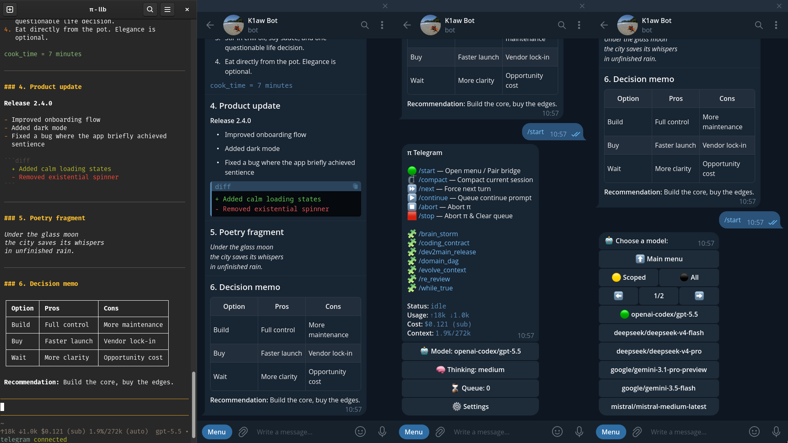

# oh-my-pi-telegram

**Telegram runtime adapter for live [Oh My Pi](https://github.com/can1357/oh-my-pi) (`omp`) sessions: send prompts, queue work, watch previews and collect artifacts from a private Telegram DM while the agent keeps running in the terminal.**

[](https://github.com/evandrodevbr/oh-my-pi-telegram/actions/workflows/validate.yml)




> Fork of [`@llblab/pi-telegram@0.22.0`](https://github.com/llblab/pi-telegram/tree/v0.22.0) (SHA `afe09c5`), republished as `@evandrodevbr/oh-my-pi-telegram` for `omp`.
> Lineage: `badlogic/pi-telegram` → `llblab/pi-telegram` (0.22.0) → **this fork**.
> The fork adds `omp` compatibility metadata in `package.json` and this README; the runtime code is upstream 0.22.0.

## About

Supervising a long agent run means staying at the keyboard, because the work lives in the terminal session. This extension removes that constraint for the part that does not need a terminal: it binds a private Telegram DM to a running `omp` instance, so text, replies, images, files and voice notes sent from the phone become ordinary turns in that instance's active session, and answers, artifacts, buttons and voice come back to the chat.

What it does:

- Accepts prompts from Telegram (text, replies, edits, images, files, albums, voice) and injects them into the active `omp` session.
- Queues turns while the agent is busy instead of interrupting the running turn, with menu controls to inspect, promote, delete or force the next item.
- Streams native "typing"/draft previews and delivers final answers as Telegram Rich Markdown, plus files through `telegram_attach`.
- Exposes an operator menu (`/start`) for status, model, thinking level, settings, queue, prompt templates and diagnostics.
- Pairs exactly one Telegram owner; other users are ignored.

What it deliberately is not: a remote terminal, a PTY, a shell, a process launcher or a session browser. It does not spawn hidden `omp` processes and does not forward arbitrary Telegram slash commands into the TUI.

## How it works

```
Telegram DM ──▶ getUpdates (single polling owner)
                   │
                   ▼
              inbound layer ──▶ Telegram turn ──▶ queue / active dispatch
                   │                                     │
                   │                                     ▼
                   │                            omp active session (model turn)
                   ▼                                     │
            inbound files to <agent-dir>/tmp/telegram    ▼
                                          streaming preview / native active status
                                                     │
                                                     ▼
                                    final Rich Markdown reply ──▶ Telegram DM
                                          (+ files, voice, inline buttons)
```

- One live `omp` instance owns polling for a profile; each Telegram destination follows that instance and sends prompts into its currently active session (it is not bound to one session file).
- A second `omp` instance started while Telegram private-chat Threaded Mode is available registers as a follower through a local leader/follower bus, each one behind its own Telegram thread.
- Companion extensions can register commands, menu sections, status rows, update/callback handlers and voice providers without owning a second bot loop.

## Stack

| Layer | Choice |
| --- | --- |
| Language | TypeScript 7, strict, run directly by the `omp`/Pi runtime (no build step) |
| Runtime | Node.js >= 22.19.0 (`node:test` + `--experimental-strip-types` for the suite) |
| Host agent | `omp` (`@oh-my-pi/pi-coding-agent` >= 16.5.2); peer deps `@earendil-works/pi-{ai,agent-core,coding-agent}` >= 0.80.6, `@sinclair/typebox` |
| Telegram transport | Direct Telegram Bot API over `undici` HTTP calls (long polling, Rich Messages, files, voice) |
| Transport hardening | Dependency `overrides` pin security-patched `protobufjs`, `undici`, `ws`, `brace-expansion` for the transitive tree |
| Package manager | npm (`package-lock.json` is the lockfile CI uses); `bun.lock` is a leftover from upstream |
| CI | GitHub Actions: `Validate` (npm ci + `npm run validate`), `Release` (tag `v*.*.*` → GitHub release from `CHANGELOG.md`) |

## Requirements

- Node.js `>= 22.19.0` (declared in `engines`; verified here on 24.20.0)
- npm `>= 10` for the validation gates (verified on 11.19.0). `bun` also works for running the extension, but the gates are npm-based.
- `omp` `>= 16.5.2` (verified with `omp` 18.1.20) or a Pi runtime exposing the same `@earendil-works/pi-*` extension API
- A Telegram bot token from [@BotFather](https://t.me/BotFather)

## Quick start

The extension is **not published to npm yet** (`npm view @evandrodevbr/oh-my-pi-telegram` returns 404), so clone the repository and install from the local checkout.

```bash
# Local development checkout, run the gates first
git clone https://github.com/evandrodevbr/oh-my-pi-telegram
cd oh-my-pi-telegram
npm ci
npm run validate

# Install into omp from the checkout (verified working; --link is NOT a valid flag)
omp install /absolute/path/to/oh-my-pi-telegram

# Confirm omp sees the extension and reads its `omp` manifest field
omp plugin list --json
omp plugin doctor
```

`omp plugin --help` documents these plugin sources: a local path (`./path`, `../path`, `/abs`, `~/path`, symlinked), `github:user/repo[#ref]` (also `gitlab:`, `bitbucket:`, `codeberg:`, `sourcehut:`), a full git URL (`https://github.com/user/repo`), `name@marketplace`, and npm specs (`pkg`, `pkg@1.2.3`). Prefer the local-path form: the package is not on npm, and omp's plugin source resolver currently rejects `npm` sources with `npm plugin sources are not yet supported. Use git-based sources instead.`

Then inside `omp`:

```text
/telegram-setup      # paste the bot token (offers a saved token as default)
/telegram-connect    # start polling for this instance
```

Finally, open the bot DM and send `/start`. The first Telegram user to write becomes the allowed owner.

Config is written to `<agent-dir>/telegram.json`. The agent directory is resolved as: `PI_CODING_AGENT_DIR` if set, then `~/.omp/agent` when the runtime is `omp`, otherwise `~/.pi/agent`.

## Usage

### Telegram commands

| Command | Purpose |
| --- | --- |
| `/start` | Pair when needed and open the operator menu (status, templates, model, thinking, settings, queue, sections) |
| `/compact` | Confirm and run session compaction |
| `/next` | Dispatch the next queued turn, aborting first if needed |
| `/continue` | Enqueue a priority continuation prompt |
| `/abort` | Abort the active run, keep the queue |
| `/stop` | Abort the active run and clear waiting Telegram turns |

`/help`, `/status`, `/model`, `/thinking`, `/queue` and `/settings` are accepted shortcuts into the same menus. Prompt templates registered in `omp` are reachable as `/template_name` commands.

### omp commands

| Command | Purpose |
| --- | --- |
| `/telegram-setup` | Save or update the default bot token |
| `/telegram-setup <profile>` | Save or update a named profile's bot token |
| `/telegram-connect` | Start polling on the default profile and take transport ownership |
| `/telegram-connect <profile>` | Activate a named profile |
| `/telegram-disconnect` | Stop polling and release ownership |
| `/telegram-status` | Connection, mode, queue, transport and recent diagnostics |

Profile names: lowercase ASCII letters and digits, up to 32 characters; `default`, `main` and `active` are reserved. Profiles keep isolated polling, diagnostics, Threaded Mode state and local bus transport.

### Tools available to the agent

| Tool | Purpose |
| --- | --- |
| `telegram_help` | Fetch the bridge contract on demand instead of keeping it in every prompt |
| `telegram_attach` | Attach a generated file to the active Telegram reply, or send it via direct delivery |
| `telegram_message` | Send Markdown text directly to the paired chat or an explicit `chat_id` (`/thread_id`) |

Assistant replies can also carry top-level hidden HTML comments: `<!-- telegram_voice: ... -->` for voice output and `<!-- telegram_button: ... -->` for inline prompt buttons. They are stripped from the visible text.

### Environment configuration

Most controls live in the Telegram menu or in `/telegram-*` commands. Environment variables cover bootstrap and transport boundaries:

| Area | Variables |
| --- | --- |
| Bot token bootstrap (used as `/telegram-setup` prefill) | `TELEGRAM_BOT_TOKEN`, `TELEGRAM_BOT_KEY`, `TELEGRAM_TOKEN`, `TELEGRAM_KEY` |
| Agent data root | `PI_CODING_AGENT_DIR` |
| Telegram network family | `PI_TELEGRAM_NETWORK_FAMILY` = `auto` (default), `ipv4`, `ipv6`, `ipv4-fallback` |
| Inbound file limit | `PI_TELEGRAM_INBOUND_FILE_MAX_BYTES`, `TELEGRAM_MAX_FILE_SIZE_BYTES` (default 50 MiB) |
| Outbound attachment limit | `PI_TELEGRAM_OUTBOUND_ATTACHMENT_MAX_BYTES`, `TELEGRAM_MAX_ATTACHMENT_SIZE_BYTES` (default 50 MiB) |
| HTTP proxy | Not implemented by the bridge: proxies come from the Node runtime itself (`node --use-env-proxy`, or `NODE_USE_ENV_PROXY=1`, honouring `HTTP_PROXY` / `HTTPS_PROXY` / `NO_PROXY`) |

Defaults: config in `<agent-dir>/telegram.json`, inbound temp files in `<agent-dir>/tmp/telegram`, `assistant.rendering = "rich"` (native Rich Markdown) with `assistant.draftPreviews = false`, and native Telegram active status for long turns.

### Extension API

Stable package entrypoints (see `exports` in `package.json`):

| Subpath | Content |
| --- | --- |
| `.` | Extension entrypoint (`index.ts`) |
| `./inbound`, `./outbound`, `./delivery`, `./activity`, `./updates`, `./commands`, `./sections`, `./status`, `./voice`, `./keyboard` | Public companion-extension APIs |

Deep `lib/*` imports are intentionally not exported. Contract details are in [`docs/public-api.md`](docs/public-api.md).

## Production and release

There is no build step: `omp` loads the TypeScript sources directly, and `npm pack` ships them.

```bash
npm run validate     # the gate: typecheck + tests + audit + pack:check
npm run pack:check   # npm pack --dry-run, 87 files, no secrets
```

Release flow: bump `package.json` version, add a matching `## <version>` section to `CHANGELOG.md`, then push the tag.

```bash
# after bumping the version and adding the CHANGELOG section
git tag v0.22.0-evandro.2 && git push origin v0.22.0-evandro.2
```

`.github/workflows/release.yml` fails fast unless the tag equals the `package.json` version and `CHANGELOG.md` has a non-empty `## <version>` section; it then runs `gh release create` with those notes. Publishing to npm (`npm publish`, `publishConfig.access = public`) has not been done yet.

## Project structure

```
index.ts                extension entrypoint: composition root and runtime wiring
api/                    public package subpaths (inbound, outbound, delivery, ...)
lib/                    54 domain modules: config, paths, polling, queue, routing,
                        rendering, outbound, bus leader/follower, locks, voice, menus
tests/                  55 node:test suites (unit + integration, no network)
docs/                   architecture and per-surface contracts
.agents/skills/         project-local agent skills (Telegram Bot API reference, domain DAG)
AGENTS.md               engineering and runtime conventions (project context, not docs)
BACKLOG.md              open, evidence-gated work items
CHANGELOG.md            release history used to build GitHub release notes
```

The doc index lives at [`docs/README.md`](docs/README.md).

## Verification

Everything below was executed in this repository on Node 24.20.0 / npm 11.19.0 (Linux, Manjaro), plus the GitHub Actions history of `main`:

| Command | Result |
| --- | --- |
| `npm ci` | exit 0, lockfile consistent, `found 0 vulnerabilities` |
| `npm run typecheck` | exit 0, `tsc --noEmit` |
| `npm test` | exit 0, `tests 1230 / pass 1229 / fail 0 / skipped 1` (the skip is a Windows-only case) |
| `npm run audit` | exit 0, `found 0 vulnerabilities` |
| `npm run pack:check` | exit 0, tarball `evandrodevbr-oh-my-pi-telegram-0.22.0-evandro.1.tgz` |
| `npm run validate` | exit 0 (the four gates above, in order, exactly as CI runs them) |
| `omp plugin list --json` | exit 0, `omp` 18.1.20 reads the package `omp` manifest (`displayName`, `extensions: ["./index.ts"]`, `compatibleWith`) |
| `omp plugin doctor` | `3 ok, 1 warnings, 0 errors` (warning: no plugin package manifest) |
| `omp install <local path>` | exit 0, `Linked @evandrodevbr/oh-my-pi-telegram from .` (the link was reverted afterwards to leave the machine as it was) |
| `omp install --link <path>` | fails: `Unknown option '--link'` (kept out of this README) |

The test suite is deterministic and offline: transport calls are injected, so no live Telegram bot is required. Live Telegram paths (long polling, Rich Messages, Threaded Mode threading) are covered by the operator's own smoke sessions, not by this suite; the `Validate` workflow (npm ci + `npm run validate` on Node 24) is green on `main` (run 34838605928, 2026-09-14).

## Current state and limitations

- **Not published to npm**: `@evandrodevbr/oh-my-pi-telegram` returns 404 on the registry. Install from a local checkout; on top of that, `omp` 18.1.20's plugin source resolver rejects `npm` sources (`npm plugin sources are not yet supported. Use git-based sources instead.`).
- **No GitHub release yet**: the only tag, `v0.22.0-evandro.1`, produced a failed `Release` run (`CHANGELOG.md has no section for 0.22.0-evandro.1`, because the fork section was a level-3 heading). The heading is fixed in this commit, but the existing tag still points at the pre-fix commit, so the release must be created manually or the tag moved.
- **Fork lags upstream**: this fork stays on upstream `0.22.0` (SHA `afe09c5`), while `@llblab/pi-telegram` has since published 0.46.0. Upstream changes after 0.22.0 are not included.
- **Verified on one platform only**: Linux with Node 24.20.0. The suite contains Windows-specific cases (and the single skipped test is one of them), but Windows/macOS were not run here.
- **Requires a live `omp` instance and a real bot token** for end-to-end use; no automated test covers the Telegram API surface itself.
- **LLM/token cost applies**: a Telegram prompt is a normal model turn in the active session, so it inherits that session's post-compaction context.
- **Single-owner by design**: the first Telegram user to message the bot is the owner; other users are ignored. No multi-user or group-chat support.
- `bun.lock` is still present from upstream while CI validates with `package-lock.json`; the two are not kept in sync.

## Documentation

| Document | Content |
| --- | --- |
| [`docs/README.md`](docs/README.md) | Documentation index |
| [`docs/architecture.md`](docs/architecture.md) | Runtime, domains, queue, transport and Threaded Mode overview |
| [`docs/public-api.md`](docs/public-api.md) | Package entrypoints and stable extension contracts |
| [`docs/delivery.md`](docs/delivery.md) | Target-aware delivery, logical message handles, leader/follower transport |
| [`docs/activity.md`](docs/activity.md) | Normalized agent lifecycle events for companion extensions |
| [`docs/inbound.md`](docs/inbound.md), [`docs/outbound.md`](docs/outbound.md), [`docs/voice.md`](docs/voice.md) | Inbound pipelines, outbound transforms and STT/TTS providers |
| [`docs/sections.md`](docs/sections.md), [`docs/updates.md`](docs/updates.md), [`docs/callback-namespaces.md`](docs/callback-namespaces.md) | Companion UI sections, update routing and callback ownership |
| [`docs/multi-instance-bus.md`](docs/multi-instance-bus.md), [`docs/locks.md`](docs/locks.md) | Leader/follower routing and singleton lock conventions |
| [`docs/ui-style.md`](docs/ui-style.md), [`docs/command-templates.md`](docs/command-templates.md) | Inline UI standards and command-template conventions |
| [`BACKLOG.md`](BACKLOG.md), [`CHANGELOG.md`](CHANGELOG.md) | Open work and delivery history |

## License

MIT. See [`LICENSE`](LICENSE), which keeps the copyright notices of the upstream chain (`badlogic/pi-telegram`, `llblab/pi-telegram`) alongside this fork's.
